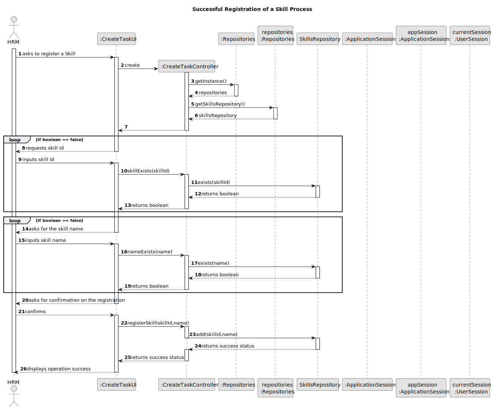
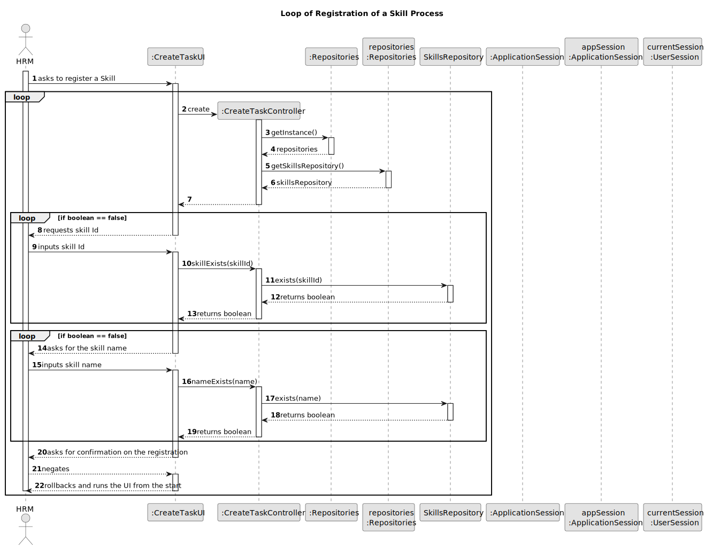
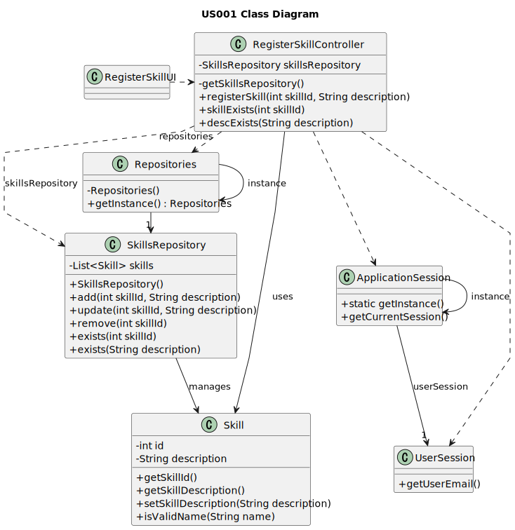

# US006 - Create a Task

## 3. Design - User Story Realization

### 3.1. Rationale

_**Note that SSD - Alternative One is adopted.**_

| Interaction ID | Question: Which class is responsible for...  | Answer                  | Justification (with patterns)                                                                                 |
|:---------------|:---------------------------------------------|:------------------------|:--------------------------------------------------------------------------------------------------------------|
| Step 1  		     | 	... interacting with the actor?             | RegisterSkillUI         | Pure Fabrication: there is no reason to assign this responsibility to any existing class in the Domain Model. |
| 			  		        | 	... coordinating the US?                    | RegisterSkillController | Controller                                                                                                    |
| 			  		        | ... knowing the user using the system?       | UserSession             | IE: cf. A&A component documentation.                                                                          |
| Step 2  		     | 							                                      |                         |                                                                                                               |
| Step 3  		     | 	...saving the inputted data?                | Skill                   | IE: object created in step 1 has its own data.                                                                | 
| Step 4  		     | 	... validating all data (local validation)? | Skill                   | IE: owns its data.                                                                                            |
| 			  		        | 	... saving the created skill?               | SkillsRepository        |                                                                                        | 
| Step 5  		     | 	... informing operation success?            | RegisterSkillUI         | IE: is responsible for user interactions.                                                                     | 

### Systematization ##

According to the taken rationale, the conceptual classes promoted to software classes are:

* Skill

Other software classes (i.e. Pure Fabrication) identified:

* RegisterSkillUI
* RegisterSkillController
* SkillsRepository

## 3.2. Sequence Diagram (SD)

### Alternative 1 - Successful flow

### Alternative 2 - User negates confirmation loop

## 3.3. Class Diagram (CD)

