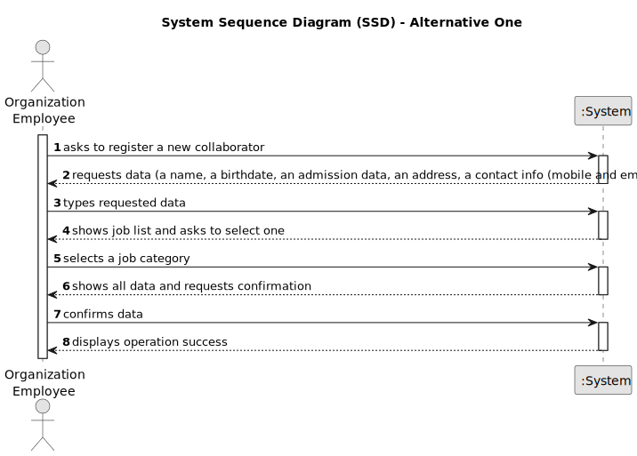

# US003 - Register a Collaborator

## 1. Requirements Engineering

### 1.1. User Story Description

As an HRM, I want to register a collaborator with a job and fundamental characteristics.

### 1.2. Customer Specifications and Clarifications 

**From the specifications document:**
>   MS has a wide range of employees who carry out the most varied tasks in the context of designing and managing green spaces. Some job examples are designer, budgetist, gardener, electrician or bricklayer.

>	Teams are temporary associations of employees who will carry out a set of tasks in one or more green spaces.

>   Thus, an employee has a main occupation (job) and a set of skills that enable him to perform/take on certain tasks/responsibilities

**From the client clarifications:**

> **Question:** Which information is mandatory to insert a collaborator in the program (fundamental characteristics)?
>
> **Answer:** name, birth date, admission date, address, contact info (mobile and email), taxpayer number, ID doc type and respective number

> **Question:** Does the HRM select the job from a list that we display?
>
> **Answer:** displaying or not, It's a matter of UX, the dev team should decide about it, but the valid jobs are the ones created within the US02.

### 1.3. Acceptance Criteria

* **AC1:** All required fields must be filled in.
* **AC2:** name, birthdate, admission date, address, contact info (mobile and email), ID doc type and respective number should be provided by HRM
* **AC3:** Upon successful registration of a collaborator and its fundamental characteristics, the system should provide confirmation to the user, indicating that the collaborator has been successfully registered.
* **AC4:** The system should have proper input validation for all fields to prevent invalid or malicious data from being entered.

### 1.4. Found out Dependencies

* There is a dependency on "US002 - As an HRM, I want to register a job that a collaborator need to have." as there must be at least one job to register a collaborator.

### 1.5 Input and Output Data

**Input Data:**

* Typed data:
    * Name
    * Birthdate
    * Admission date
    * Address
    * Contact info (mobile and email)

  
* Selected data:
    * Job
    * Skills

**Output Data:**

* Collaborator final details.
* (In)Success of the operation.

### 1.6. System Sequence Diagram (SSD)

