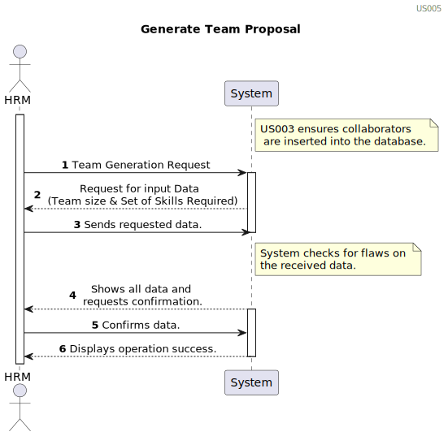

# US005- Generate Team Proposal 

## 1. Requirements Engineering

### 1.1. User Story Description

As an HRM, I want to generate a team proposal automatically.

### 1.2. Customer Specifications and Clarifications 

**From the specifications document:**

>	Teams are temporary associations of employees who will carry out a set of tasks in one or more green spaces.

>	When creating multipurpose teams, the number of members and the set of skills that must be covered are crucial.

**From the client clarifications:**

> **Question:** What information will the customer provide?
>
> **Answer:** The customer provide the max size of the team and a set of skills.

> **Question:** What should the output of the automation be? (should it just store the team proposal or show it to the customer?)  Will the team proposal be a document about all the instructions of each team member/worker?
>
> **Answer:** The systems provide team proposals and HRM can accept of refuse the proposals. In the future (not in this sprint) HRM may decide to edit the team.

### 1.3. Acceptance Criteria

* **AC1:** The maximum team size and the set of skills need to be supplied by the HRM.
* **AC2:** The system shall validate that the maximum size of the team provided by the customer is a positive integer greater than zero.
* **AC3:** The system shall ensure that the set of skills provided by the customer is non-empty.
* **AC4:** The system shall present the generated team proposals to the HRM for review.
* **AC5:** The HRM shall have the ability to accept or refuse each team proposal.
* **AC6:** If a team proposal is refused, the system shall allow the HRM to provide feedback or suggestions for improvement.
* **AC7:** The system shall handle errors gracefully, providing meaningful error messages to the HRM in case of invalid inputs or system failures.
* **AC8:** Accepted team proposals shall be stored for future reference.
* **AC9:** The system shall make sure no duplicate teams exist.
* **AC10:** The system provides each team an identifier.

### 1.4. Found out Dependencies

* There is a dependency on "US003 - Register a Collaborator" as there must be available collaborators to make a team.

### 1.5 Input and Output Data

**Input Data:**

* Typed data:
    * Maximum team size.
    * Set of skills required.

**Output Data:**

* List of existing teams.
* (In)Success of the operation

### 1.6. System Sequence Diagram (SSD)

### 1.7 Other Relevant Remarks

* The created team stays in a "not assigned" state in order to distinguish from "assigned" teams to individual tasks.