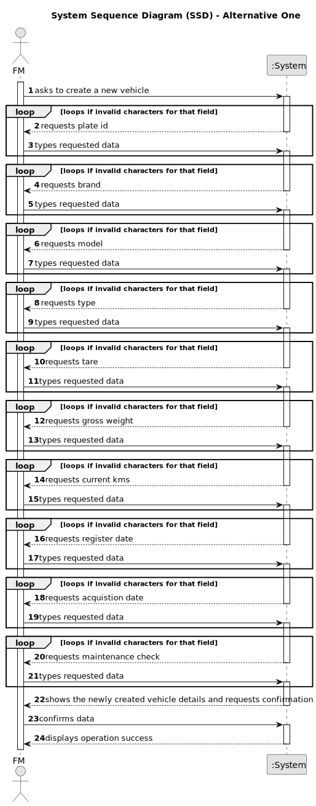

# US006 - Register a Vehicle

## 1. Requirements Engineering

### 1.1. User Story Description

As an FM, I wish to register a vehicle including Brand, Model, Type, Tare,
Gross Weight, Current Km, Register Date, Acquisition Date, Maintenance/Check-
up Frequency (in Kms).
### 1.2. Customer Specifications and Clarifications 

**From the specifications document:**

>	Vehicles are needed to carry out the tasks assigned to the teams as well as to transport
machines and equipment. This type of vehicle can be only for passengers or mixed,
light or heavy, open box or closed vans or trucks.

**From the client clarifications:**

> **Question:** can a fm register no vehicles or does he have to regsiter at least one?
>
> **Answer:** The VFM is a role or system user profile that has the rights to perform some system actions (like the ones described by the US06, US07 and US08).
In theory, if there is no need to register a vehicle, no vehicles will be registered but that would be rather odd.

> **Question:** Should the application identify a registered vehicle by a serial number or other attribute?
>
> **Answer:** By plate id;

### 1.3. Acceptance Criteria

* **AC1:** All required fields must be filled in.
* **AC2:** Upon successful registration of a vehicle, the system should provide confirmation to the user, indicating that the vehicle has been successfully registered.
* **AC3:** The system should have proper input validation for all fields to prevent invalid or malicious data from being entered.

### 1.4. Found out Dependencies

* There is no dependencies found.

### 1.5 Input and Output Data

**Input Data:**

* Typed data:
    * plate id
    * brand
    * model 
    * type
    * tare
    * gross weight
    * current kms
    * register date
    * acquisition date
    * maintenance/Check-up frequency

**Output Data:**

* The newly created vehicle and its details
* (In)Success of the operation

### 1.6. System Sequence Diagram (SSD)

