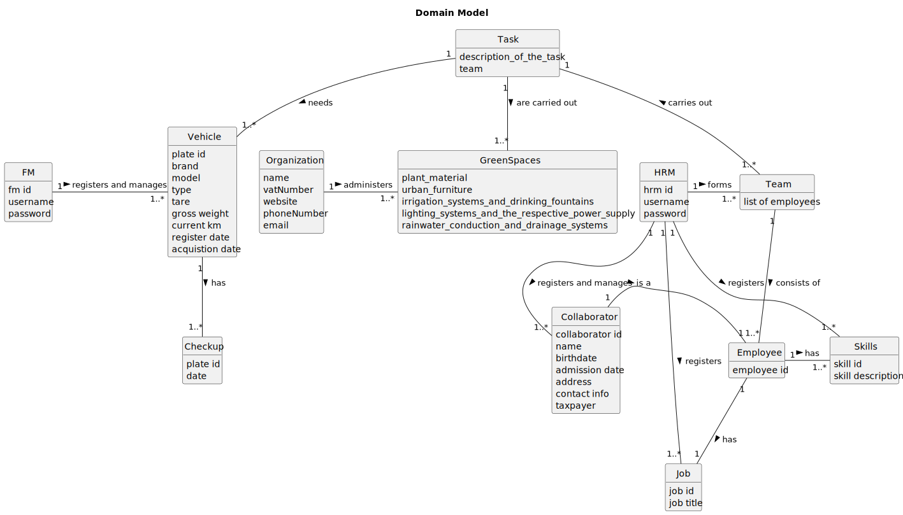

# OO Analysis

### _Conceptual Class Category List_

**Product/Service related to a Transaction or Transaction Line Item**

* Tasks

---

 

**Roles of People or Organizations**

* HRM
* VM
* Employee
* Collaborator
* Team

---

**Places**

* Green Spaces

---

**Physical Objects**

* Vehicle

---

**Descriptions of Things**

* Job
* Skills

---

**Records of finance, work, contracts, legal matters**

* Check-up

---

## Rationale to identify associations between conceptual classes

An association is a relationship between instances of objects that indicates a relevant connection and that is worth of remembering, or it is derivable from the List of Common Associations:

- **_A_** is physically or logically part of **_B_**
- **_A_** is physically or logically contained in/on **_B_**
- **_A_** is a description for **_B_**
- **_A_** known/logged/recorded/reported/captured/needed/registers/administers **_B_**
- **_A_** uses or manages or owns **_B_**
- **_A_** is related with a transaction (item) of **_B_**
- **_A_** is related with a transaction (item) of **_B_**

| Concept (A) 		  |    Association   	     |  Concept (B) |
|-----------------|:----------------------:|-------------:|
| Organization  	 |   administers   		 	   | Green Spaces |
| Tasks 	         | are carried out   		 	 | Green Spaces |
| Tasks 	         |      needs  		 	       |      Vehicle |
| Team	           |   carries out  		 	    |        Tasks |
| Team 	          |    is made of  		 	    |    Employees |
| Employee	          |    has 		 	    |    Job  |
| Employee		          |    has   		 	    |    Skills |
| HRM	          |    registers  		 	    |    Job |
| HRM		          |   registers   		 	    |    Skills |
| HRM 	          |    registers and manages 		 	    |    Collaborator |
| Collaborator	   |       is a  		 	       |     Employee |
| FM	             | registers and manages   		 	 | Vehicle |
| Vehicle	         | has  		 	 | Checkup |
| Tasks 	         | are carried out   		 	 | Green Spaces |

## Domain Model

