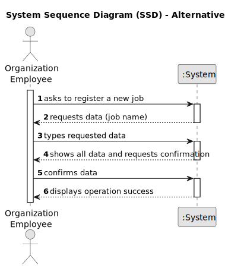

# US002 - Register a Job

## 1. Requirements Engineering

### 1.1. User Story Description

As an HRM, I want to register a job that a collaborator need to have.

### 1.2. Customer Specifications and Clarifications 

**From the specifications document:**

>	"Thus, an employee has a main occupation (job) and  a set of skills that enable him to perform/take on certain tasks/responsibilities, for example, driving vehicles of different types (e.g. light, or heavy), operating machines such
as backhoes or tractors; tree pruning; application of agriculture phytopharmaceuticals." 

>	"Collaborator is a person who is an employee of the organization and carries out
design, construction and/or maintenance tasks for green areas, depending on their
skills."

**From the client clarifications:**

> **Question:** Quais são os dados de entrada para a criação de uma profissão?
>
> **Answer:** o Nome da profissão:
jardineiro
calceteiro
electricista
condutor
...

> **Question:**É relevante associar uma área ou setor específico a cada Job? (Por exemplo, "Jardineiro" seria inserido no setor de "Manutenção")
>
> **Answer:** É relevante associar uma área ou setor específico a cada Job? (Por exemplo, "Jardineiro" seria inserido no setor de "Manutenção")

### 1.3. Acceptance Criteria

* **AC1:** All required fields must be filled in.
* **AC2:** The task reference must have at least 5 alphanumeric characters.
* **AC3:** When creating a task with an existing reference, the system must reject such operation and the user must be able to modify the typed reference.
* **AC4:** Upon successful registration of a job, the system should provide confirmation to the user, indicating that the job has been successfully registered.
* **AC5:** The system should have proper input validation for all fields to prevent invalid or malicious data from being entered.
* **AC5:** When registering the job, special characters or numbers cannot be entered.

### 1.4. Found out Dependencies

* There are no found dependencies for this user case story.

### 1.5 Input and Output Data

**Input Data:**

* Typed data:
    * A job name - name of the job that the collaborator practice.
    * a designation - Title or name of the job task.
    * an informal description - A brief, non-technical description of the job task.
    * a technical description - A detailed, technical description of the job task.
    * an estimated duration - Approximate time required to complete the job task.
    * an estimated cost - Approximate cost associated with completing the job task.
	
* Selected data:
    * a task category - Category or type of the job task selected from predefined options.

**Output Data:**

* List of existing task categories - List of available categories for job tasks.
* (In)Success of the operation - - Indicates whether the job registration was successful or not.

### 1.6. System Sequence Diagram (SSD)

**_Other alternatives might exist._**

