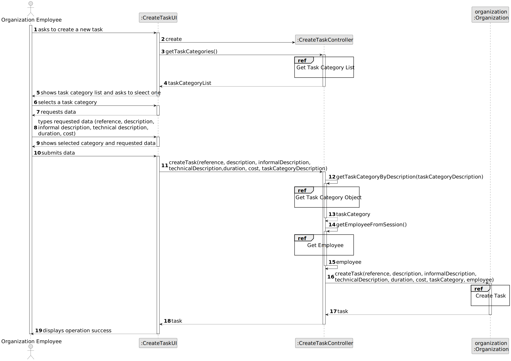
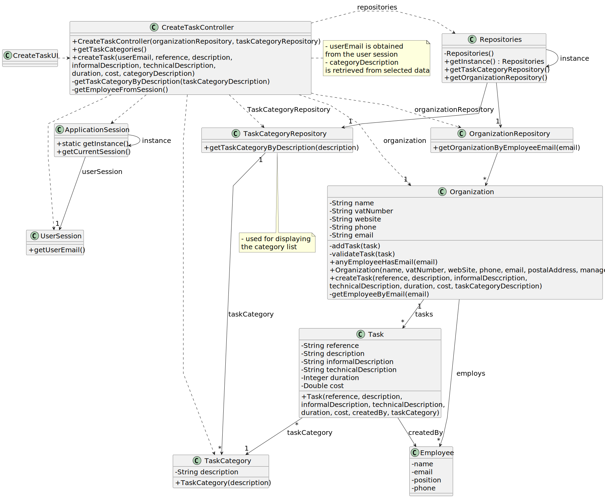

# US002 - Register a job 

## 3. Design - User Story Realization 

### 3.1. Rationale

_**Note that SSD - Alternative One is adopted.**_

| Interaction ID                                       | Question: Which class is responsible for...                | Answer              | Justification (with patterns)                                                                          |
|:-----------------------------------------------------|:-----------------------------------------------------------|:--------------------|:-------------------------------------------------------------------------------------------------------|
| Step 1: asks to register a new job  		               | 	 ...initiating the process of registering a new job?      | CreateJobUI         | UI: initiates the interaction process with the HRM (Human Resources Manager) to create a new job.      |
| 			  		                                              | 	...coordinating the interaction with the user interface?  | CreateJobController | Controller: coordinates operations between the user interface and the system components.               |
| 			  		                                              | 	... instantiating a new Job?                              | JobRepository       | Creator (Rule 1): Skill is a fundamental entity in the Domain Model.                            |
| Step 2:  requests data (jobName)  		                 | 	...displaying the form for the actor to input data?						 | CreateJobUI         | Pure Fabrication: there is no reason to assign this responsibility to any existing class in the Domain Model. |
| Step 3: types requested data  		                     | 	...validating input data?                                 | CreateJobUI         | Pure Fabrication: there is no reason to assign this responsibility to any existing class in the Domain Model.                        |
| Step 4: shows all data and requests confirmation  		 | 	...displaying all the information before confirming?      | CreateJobUI         | Pure Fabrication: there is no reason to assign this responsibility to any existing class in the Domain Model.                                                 |
| Step 5: confirms data  		                            | 	... validating all data (local validation)?               | Job                 | IE: owns its data.                                            |
|                                                      | ...validating all data (global validation)?                | JobRepository       |   IE: knows all its jobs.                                                            |
|                                                      | ... saving the created task?                               | JobRepository       |                        IE: owns all its jobs.                                                              |
| Step 6: displays operation success  		                                         | ...informing operation success?							                     | CreateJobUI         | Pure Fabrication: there is no reason to assign this responsibility to any existing class in the Domain Model.                                                                                                       |              

### Systematization ##

According to the taken rationale, the conceptual classes promoted to software classes are: 

* Organization
* Task

Other software classes (i.e. Pure Fabrication) identified: 

* CreateTaskUI  
* CreateTaskController

## 3.2. Sequence Diagram (SD)

_**Note that SSD - Alternative Two is adopted.**_

### Full Diagram

This diagram shows the full sequence of interactions between the classes involved in the realization of this user story.

### Split Diagrams

The following diagram shows the same sequence of interactions between the classes involved in the realization of this user story, but it is split in partial diagrams to better illustrate the interactions between the classes.

It uses Interaction Occurrence (a.k.a. Interaction Use).

**Get Task Category List Partial SD**

**Get Task Category Object**

**Get Employee**

**Create Task**

## 3.3. Class Diagram (CD)

