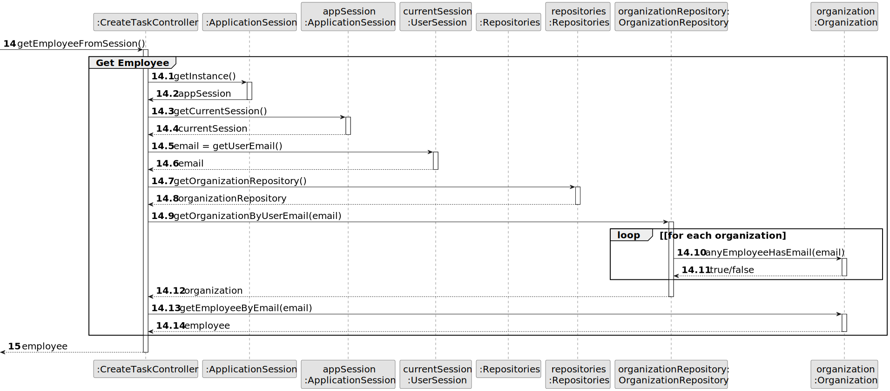

# US003 - Register a Collaborator

## 3. Design - User Story Realization 

### 3.1. Rationale

_**Note that SSD - Alternative One is adopted.**_

| Interaction ID | Question: Which class is responsible for...                                                                         | Answer                                          | Justification (with patterns)                                                                                                                                                                                                                                                                                                                                                                                                                                                                                                                                                                                                                      |
|:---------------|:--------------------------------------------------------------------------------------------------------------------|:------------------------------------------------|:---------------------------------------------------------------------------------------------------------------------------------------------------------------------------------------------------------------------------------------------------------------------------------------------------------------------------------------------------------------------------------------------------------------------------------------------------------------------------------------------------------------------------------------------------------------------------------------------------------------------------------------------------|
| Step 1  		     | 	... interacting with the actor?                                                                                    | CreateCollaboratorUI                            | Pure Fabrication: There is no specific class in the domain model responsible for user interface interactions. Therefore, a pure fabrication, such as a UI component, is used to handle these interactions.                                                                                                                                                                                                                                                                                                                                                                                                                                         |
| 			  		        | 	... coordinating the US?                                                                                           | CreateCollaboratorController                    | Controller: The controller orchestrates the flow of the user story, handling user input and coordinating actions between the UI and the domain model.                                                                                                                                                                                                                                                                                                                                                                                                                                                                                              |
|                | ... instantiating a new Collaborator?	                                                                              | Organization                                    | Creator (Rule 1): The responsibility for creating instances of Collaborator objects lies within the domain model. Organization, as part of the domain model, fulfills this responsibility.                                                                                                                                                                                                                                                                                                                                                                                                                                                         |
| 			  		        | 	... knowing which job categories are available?                                                                                    | JobRepository                                   | Indirection: The JobRepository is responsible for accessing and providing information about the available job categories in the system.                                                                                                                                                                                                                                                                                                                                                                                                                                                                                                            |
| 			  		        | ... knowing the job categories associated with the selected job?                                                                                     | Organization                                    | Indirection: The Organization is responsible for accessing and manipulating information about the job categories associated with a selected job.                                                                                                                                                                                                                                                                                                                                                                                                                                                                                                   |
| Step 2  		     |  							                                                                               |                             |                                                                                                                                                                                                                                                                                                                                                                                                                                                                                                                                                                                                                                                    |
| Step 3  		     | 	... saving the inputted data?                                                                                   | Collaborator                            | IE: The Collaborator object created in Step 1 is responsible for storing and managing the inputted data, ensuring its persistence within the system.                                                                                                                                                                                                                                                                                                                                                                                                                                                                                               |
| Step 4  		     | 	.. selecting the job category?	                                                                                   | UI                            | IE: The UI is responsible for allowing the user to select a job category from the available ones.                                                                                                                                                                                                                                                                                                                                                                                                                                                                                                                                                  |
|                |          ... knowing the job details to display?                                                                                                          |     Organization                          | IE: The Organization is responsible for accessing and providing detailed information about the available jobs in the system.                                                                                                                                                                                                                                                                                                                                                                                                                                                                                                                       |
| Step 5  		     | 	... saving the selected job category?                                                                                      | Collaborator                            | IE: The Collaborator object created in Step 1 is associated with a specific job category, therefore it is responsible for saving the selected category.                                                                                                                                                                                                                                                                                                                                                                                                                                                                                            |
| Step 6  		     | 							                                                                                                             |                                                 |                                                                                                                                                                                                                                                                                                                                                                                                                                                                                                                                                                                                                                                    |              
| Step 7  		     | 	 ... validating all data?                                                                              | Collaborator                          | IE: The Collaborator is responsible for validating the integrity and validity of its own data, ensuring it complies with business rules.                                                                                                                                                                                                                                                                                                                                                                                                                                                                                                                                                                                                                                                   | 
| 			  		        | 	... saving the created collaborator?                                                                                  | Organization                                    | IE: The Organization is responsible for persisting the created Collaborator instances in the system, ensuring their integrity and future availability.                                                                                                                                                                                                                                                                                                                                                                                                                                                                                                                                                                                  | 
| Step 8  		     | 	... informing operation success?                                                                                   | CreateCollaboratorUI                            | IE: CreateCollaboratorUI handles user interactions and feedback, including notifying the user about the successful completion of the operation.                                                                                                                                                                                                                                                                                                                                                                                                                                                                                                                                                                                                                                               | 

### Systematization ##

According to the taken rationale, the conceptual classes promoted to software classes are: 

* Organization
* Task

Other software classes (i.e. Pure Fabrication) identified: 

* CreateTaskUI  
* CreateTaskController

## 3.2. Sequence Diagram (SD)

_**Note that SSD - Alternative Two is adopted.**_

### Full Diagram

This diagram shows the full sequence of interactions between the classes involved in the realization of this user story.

### Split Diagrams

The following diagram shows the same sequence of interactions between the classes involved in the realization of this user story, but it is split in partial diagrams to better illustrate the interactions between the classes.

It uses Interaction Occurrence (a.k.a. Interaction Use).

**Get Task Category List Partial SD**

**Get Task Category Object**

**Get Employee**

**Create Task**

## 3.3. Class Diagram (CD)

