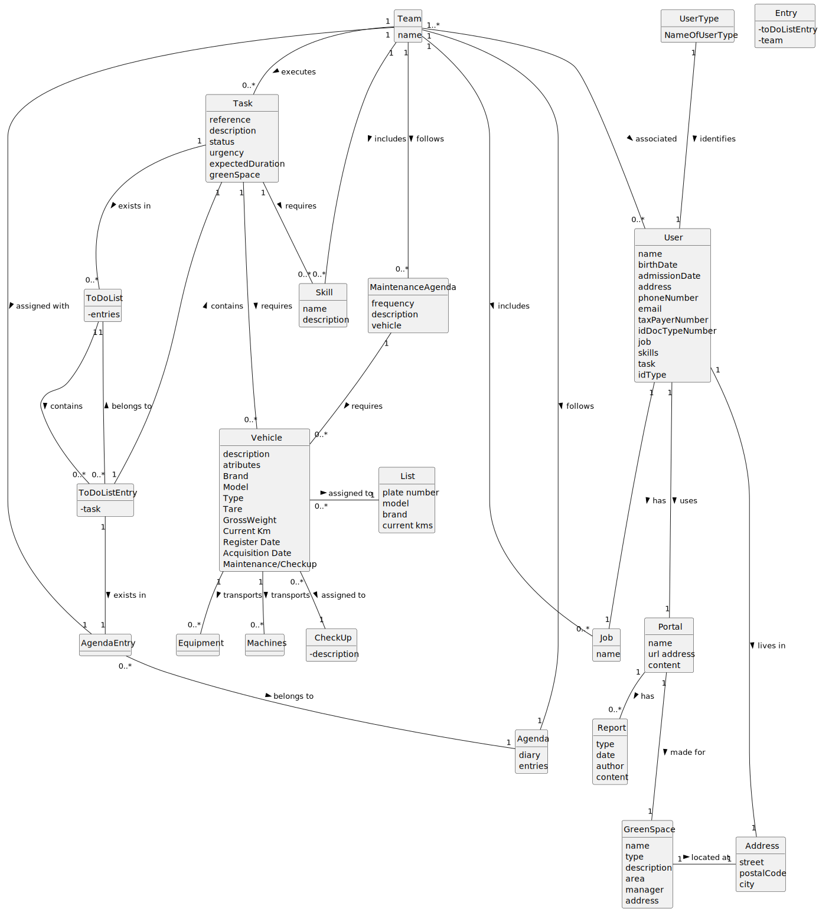

# OO Analysis

### _Conceptual Class Category List_

**Product/Service related to a Transaction or Transaction Line Item**

* Equipment: Refers to machinery, tools, or devices used in various tasks or operations.
* Vehicle: Denotes any motorized or non-motorized conveyance designed for transportation or task execution.
* Machine: Signifies any mechanical device or apparatus employed in different tasks.
* Automotive Inspection: An evaluation process specifically focused on assessing the condition, safety, and compliance of vehicles.

---

 

**Roles of People or Organizations**

* Collaborator: Responsible for tasks related to green space management.
* Human Resources Manager: The person in charge of managing human resources within the organization.
* Fleet Manager: An individual overseeing human resources, particularly related to fleet management.
* Green Spaces Manager: The accountable person for overall green space management.
* Green Spaces User: Someone who utilizes the green spaces overseen by the organization.

---

**Places**

* Green Space: Refers to the various green areas managed by the organization, including gardens and parks.

---

**Physical Objects**

* Equipment: Includes tools, machinery, and devices used by collaborators to perform various tasks within the domain.
* Vehicle: Represents motorized or non-motorized conveyances used for transportation or task execution.
* Machine: Refers to mechanical devices used for specific purposes.
* Plant Material: Encompasses all items related to plants within the green space.
* Urban Furniture: Includes functional and aesthetic elements placed in urban or public spaces.
* Infrastructure: Comprises essential structures, systems, and facilities that support green spaces.

---

**Descriptions of Things**

* Skill: Denotes the unique abilities, expertise, or competencies that individuals possess.
* Job: Represents specific roles or positions within an organization.

---

**Records of finance, work, contracts, legal matters**

* Work records:  Documentation that captures information about tasks performed within green spaces.

* Maintenance records:  Detailed documentation specifically focused on maintenance activities.

---

## Rationale to identify associations between conceptual classes

An association is a relationship between instances of objects that indicates a relevant connection and that is worth of remembering, or it is derivable from the List of Common Associations:

- **_A_** is physically or logically part of **_B_**
- **_A_** is physically or logically contained in/on **_B_**
- **_A_** is a description for **_B_**
- **_A_** known/logged/recorded/reported/captured/needed/registers/administers **_B_**
- **_A_** uses or manages or owns **_B_**
- **_A_** is related with a transaction (item) of **_B_**

| Concept (A) 		  |             Association   	             |  Concept (B) |
|-----------------|:---------------------------------------:|-------------:|
|  UserType                |               identifies                |  User            |
| User                         |                  uses                   |    Portal              |
|  User                        |                  lives                  |    Address              |
|  User                        |                   has                   |  Job                |
|   Task                       |                requires                 |    Skill              |
| Task  	 |             requires   		 	             | Vehicle |
| GreenSpace 	         |            located at   		 	            | Address |
| Portal 	         |             made for   		 	             |      GreenSpace |
| Portal	           |                has  		 	                |        Report |
| Team 	          |             executes  		 	              |    Task |
| Team	          |              includes 		 	              |    Job  |
| Team		          |            associated   		 	            |    User |
| Team	          |             includes  		 	              |    Skill |
| Team		          |             follows   		 	              |    Agenda |
| Team 	          |               follows	 	                |     MaintenanceAgenda |
| Maintenance         |                requires  		 	                | Vehicles |
| Vehicle 	         |        assigned to   		 	          | CheckUp |
|  Vehicle                 |    assigned to       		 	                                      | List             |
|  Vehicle                 |  transports                                        |     Equipment         |
|  Vehicle                 |   transports                                       |  Machines            |

## Domain Model

