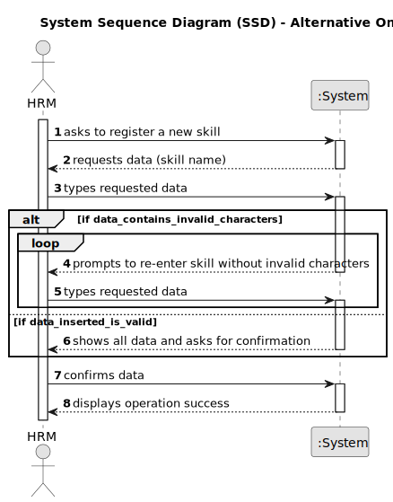

# US001 - Register a Skill 

## 1. Requirements Engineering

### 1.1. User Story Description

As a Human Resources Manager (HRM), I want to register skills that a collaborator may have.

### 1.2. Customer Specifications and Clarifications 

**From the specifications document:**

>	"Thus, an employee has a main occupation (job) and  a set of skills that enable him to perform/take on certain tasks/responsibilities, for example, driving vehicles of different types (e.g. light, or heavy), operating machines such
as backhoes or tractors; tree pruning; application of agriculture phytopharmaceuticals."

>	"Collaborator is a person who is an employee of the organization and carries out
design, construction and/or maintenance tasks for green areas, depending on their
skills."

**From the client clarifications:**

> **Question:** The indentificator of the skill will be the name, or the system will generate authomatically and Id when the manager insert the name?
>
> **Answer:** A skill is just a name, can be a composition os words like "Light Vehicle Driving Licence".
I have no knowledge about systems IDs.

> **Question:** Should the system able the HRM to introduce multiple skills in one interaction before saving all of them?
>
> **Answer:** Hi, it's not required to do so.

### 1.3. Acceptance Criteria

* **AC1:** All required fields must be filled in.
* **AC2:** Upon successful registration of a skill, the system should provide confirmation to the user, indicating that the skill has been successfully registered.
* **AC3:** The system should have proper input validation for all fields to prevent invalid or malicious data from being entered.

### 1.4. Found out Dependencies
 No dependencies were found.

### 1.5 Input and Output Data

**Input Data:**

* Typed data:
  - skill information
  - operation confirmation

**Output Data:**

* (In)Success of the operation
* Existence of illegal characters on the skill information

### 1.6. System Sequence Diagram (SSD)

