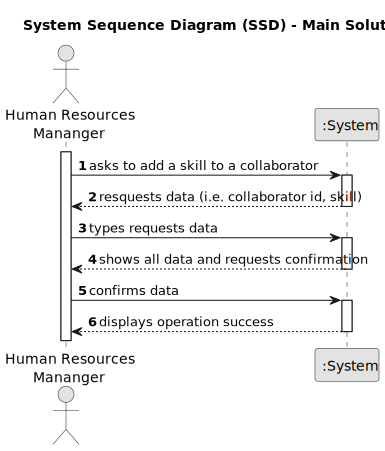

# US004 - Assign skills to a collaborator

## 1. Requirements Engineering

### 1.1. User Story Description

As an HRM, I want to assign one or more skills to a collaborator.

### 1.2. Customer Specifications and Clarifications

**From the specifications document:**

>	"Thus, an employee has a main occupation (job) and
a set of skills that enable him to perform/take on certain tasks/responsibilities, for example, driving vehicles of different types (e.g. light, or heavy), operating machines such
as backhoes or tractors; tree pruning; application of agriculture phytopharmaceuticals."

>	"• Collaborator – a person who is an employee of the organization and carries out
design, construction and/or maintenance tasks for green areas, depending on their
skills."

**From the client clarifications:**

> **Question:** Há um número mínimo e máximo de número de skills?
>
> **Answer:** Não.

> **Question:** Há alguma característica especial que seja necessária o colaborar ter para que lhe sejam adicionadas estas skills?
>
> **Answer:** Não.

### 1.3. Acceptance Criteria

* **AC1:** All required fields must be filled in.
* **AC2:** The task reference must have at least 5 alphanumeric characters.
* **AC3:** When assigning an already added skill to a collaborator, the system must reject such operation.
* **AC4:** The system should provide feedback confirming successful assignment of skills to the collaborator.
* **AC5:** Any errors or invalid inputs during the skill assignment process should be clearly communicated to the user with appropriate error messages.

### 1.4. Found out Dependencies

* There is a dependency on "US05 - As a HRM, I want to generate a team proposal automatically." because the system needs to know the skills of each collaborator to create effective team proposals. Without this information, it can't generate proposals with the right skill sets.
* There is a dependency on "US08 - As an FM, I want to list the vehicles needing the check-up" because the system needs to know which collaborators have the skills required to perform vehicle check-ups. Without this information, it can't list the vehicles needing check-up or assign the task to the right person.

### 1.5 Input and Output Data

**Input Data:**

* Selected data:
  * HRM's selection of collaborator
  * Specification of skill(s) to assign

**Output Data:**

* Success of failure message inficating the outcome of the assignment operation.

### 1.6. System Sequence Diagram (SSD)

