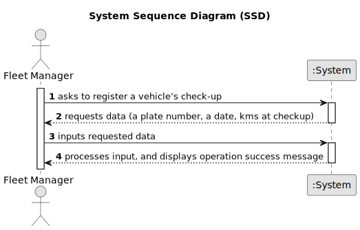

# US007 - Register a vehicle’s check-up 

## 1. Requirements Engineering

### 1.1. User Story Description

As an FM, I want to register a vehicle’s check-up.

### 1.2. Customer Specifications and Clarifications 

**From the specifications document:**

>	Vehicles are needed to carry out the tasks assigned to the teams as well as to transport machines and equipment
>	 This type of vehicle can be only for passengers or mixed, light or heavy, open box or closed vans or trucks
> 
**From the client clarifications:**

> **Question:** which attributes will you need for the vehicle's check-up?
>
> **Answer:** Plate number, date, kms at checkup

> **Question:** Does the HRM need to specify the task first for the team to be generated?
>
> **Answer:** No

### 1.3. Acceptance Criteria

* **AC1:** The fields are: plate number, date, kms at checkup
* **AC2:** All required fields must be filled in.
* **AC3:** Validation requirements for the plate number: After 2020: AA-00-AA; between 2005-2020 00-AA-00; between 1992-2005 00-00-XX
* **AC2:** Upon successful registration of a check-up, the system should provide confirmation to the user, indicating that the check-up has been successfully

### 1.4. Found out Dependencies

* There is a dependency on "US006 - As an FM, I wish to register a vehicle including Brand, Model, Type, Tare,
  Gross Weight, Current Km, Register Date, Acquisition Date, Maintenance/Checkup Frequency (in Kms)." as there must be we need the vehicle information.

### 1.5 Input and Output Data

**Input Data:**

* Typed data:
    * a plate number
    * a date
  
  
* Selected data:
    * a vehicle

**Output Data:**

* (In)Success of the operation

### 1.6. System Sequence Diagram (SSD)

**_Other alternatives might exist._**

#### Alternative One

