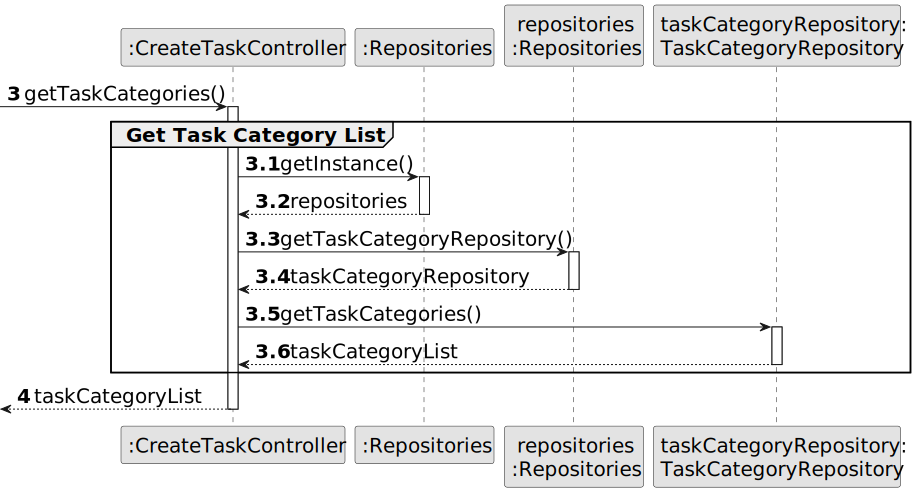
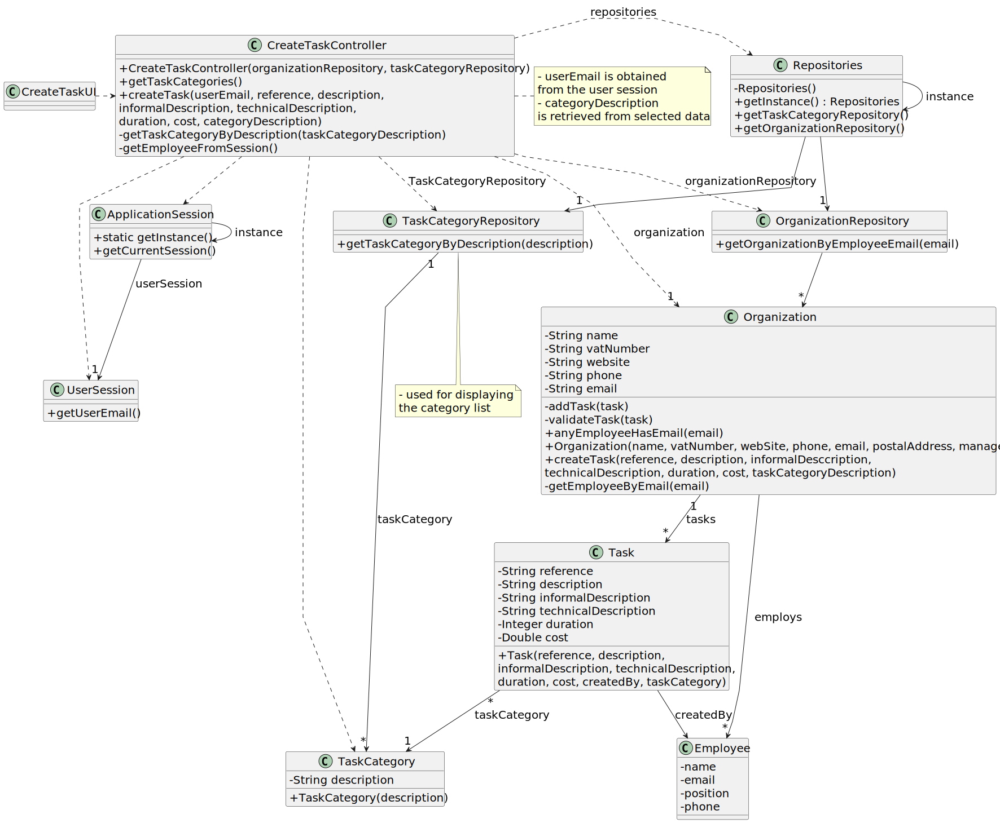

# US007 - Register a vehicle’s check-up

## 3. Design - User Story Realization 

### 3.1. Rationale

_**Note that SSD - Alternative One is adopted.**_

| Interaction ID | Question: Which class is responsible for...  | Answer                  | Justification (with patterns)                                                                                 |
|:-------------  |:---------------------------------------------|:------------------------|:--------------------------------------------------------------------------------------------------------------|
| Step 1  		 | 	... interacting with the actor?             | CreateCheckupUI         | Pure Fabrication: There is no specific class in the domain model responsible for user interface interactions. Therefore, a pure fabrication, such as a UI component, is used to handle these interactions. |
| 			  		 | 	... coordinating the US?                    | CreateCheckupController | Controller: The controller orchestrates the flow of the user story, handling user input and coordinating actions between the UI and the domain model.                                                                                                    |
| 			  		 | 	... instantiating a new Checkup?                    | CheckupRepository       | Creator (Rule 1): The responsibility for creating instances of Checkup objects lies within the domain model. CheckupRepository, as part of the domain model, fulfills this responsibility.                                                     |
| 			  		 | ... knowing which vehicles are available?       | CheckupRepository       | Indirection: The CheckupRepository is responsible for accessing and providing information about the available vehicles in the system.                                                                      |
| Step 2  		 | 							                                      |                         |                                                                                                               |
| Step 3  		 | 	...saving the inputted data?                | Checkup                 | IE: The Checkup object created in Step 1 is responsible for holding and managing the inputted data, ensuring its persistence within the system.                                                              |
|            |              ... selecting the vehicle?                                | UI                      |      IE: The UI allows the user to select a vehicle from the available ones.                                                                                                                                                                                                        |
| Step 4  		 | 	... confirming the inputted data?     | UI                      | 	IE: The UI displays the selected vehicle and inputted data and requests confirmation from the user.                                                   |
| Step 5  		 | ... confirming the data?          | UI                      | IE: The UI confirms the data entered by the user.                                               |
|            |    ... creating the checkup?	                               | CreateCheckupController |    Controller: The controller coordinates the creation of the checkup, handling interactions between the UI and the domain model.                                                                                             |
|            |          ... retrieving existing checkups?                         | CheckupRepository       |   Indirection: The CheckupRepository is responsible for retrieving existing checkups by description.                                                                                              |
|            |    ... validating the checkup?                               | Organization            | IE: The Organization validates the checkup before adding it to the system.                                                                                                |
|            |  ... adding the checkup to the system?                                                            | Organization            |     IE: The Organization adds the validated checkup to the system.                                                                                            |
| Step 6  		 | 							                                      |                         |                                                                                                               |              
| Step 7  		 | 	... informing operation success? | UI                      |         IE: The UI displays the operation success to the user.                                                                            | 

### Systematization ##

According to the taken rationale, the conceptual classes promoted to software classes are: 

* Organization
* Task

Other software classes (i.e. Pure Fabrication) identified: 

* CreateTaskUI  
* CreateTaskController

## 3.2. Sequence Diagram (SD)

_**Note that SSD - Alternative Two is adopted.**_

### Full Diagram

This diagram shows the full sequence of interactions between the classes involved in the realization of this user story.

### Split Diagrams

The following diagram shows the same sequence of interactions between the classes involved in the realization of this user story, but it is split in partial diagrams to better illustrate the interactions between the classes.

It uses Interaction Occurrence (a.k.a. Interaction Use).

**Get Task Category List Partial SD**

**Get Task Category Object**

**Get Employee**

**Create Task**

## 3.3. Class Diagram (CD)

