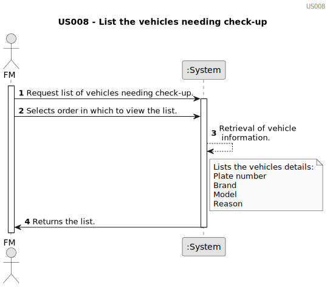

# US020 - Register a green space 

## 1. Requirements Engineering

### 1.1. User Story Description

As a Green Space Manager (GSM), I want to register a green space (garden, medium-sized park or large-sized park) and its respective area.

### 1.2. Customer Specifications and Clarifications 

**From the specifications document:**
>  Green spaces for collective use can vary significantly in dimensions and
available amenities. They may range from small landscaped areas, parks
with trees and some amenities like benches or playgrounds, to parks with
multiple hectares (e.g., in Porto, there are the Parque da Cidade - City Park - the Parque Oriental - the Oriental Park), wooded areas, lakes, and various facilities and installations.

**From the client clarifications:**

> **Question:** We understand that type (garden, medium-size, large-size), area, name, and address are required inputs for a Green Space (and if we are wrong in this, please correct us), but are there any other inputs that we are unaware of?
>
> **Answer:** Seems enough.

> **Question:** To register a green space, what is the criteria needed to classify it as a medium-sized park or a large-sized park?
>
> **Answer:** It's a GSM responsability to decide the classification.

### 1.3. Acceptance Criteria

* **AC1:** The registration form should require the GSM to input the necessary details for the green space, including but not limited to:
  * Name of the green space
  * Location (address or coordinates)
  * Size or area of the green space

  
* **AC2:** The registration form should include validation checks to ensure that all required fields are filled out appropriately.

### 1.4. Found out Dependencies

* There is a dependency on "US27 - As a GSM, I need to list all green spaces managed by me." because, to register a new green space, the Green Space Manager (GSM) needs to first view a list of all the green spaces they manage.
### 1.5 Input and Output Data

* Typed data:
  * Name of the green space
  * Location (address or coordinates)
  * Size or area of the green space

* Selected data:

**Output Data:**

### 1.6. System Sequence Diagram (SSD)

