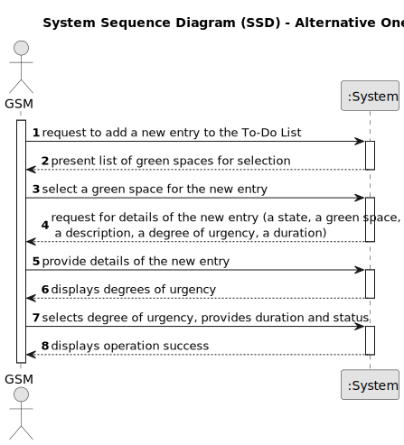

# US021 - Adding Entries for GSM. 

## 1. Requirements Engineering

### 1.1. User Story Description

As a GSM, I want to add a new entry to the To-Do List.

### 1.2. Customer Specifications and Clarifications 

**From the client clarifications:**

**From the specifications document:**

> The Agenda is a crucial mechanism for planning the week’s work. Each entry
in the Agenda defines a task (that was previously included in the to-do list).

>  The management of green areas for public use requires the timely management and completion of multiple tasks throughout the year. In the daily
management, the GSM uses two essential tools: the Agenda and the Task
List (aka To-Do List). The To-Do List comprises all the tasks required to
be done in order to assure the proper functioning of the parks.

> **Question:** And when it comes to To-Do List entries, we identified a state (planned, postponed, completed, canceled), a green space, a title, and a description as inputs for a To-Do List entry. But are there any more?
>
> **Answer:** In the text you can find: the degree of urgency (High, Medium,and Low), and the approximate expected duration.

> **Question:** When a new entry is added to the ToDo list, the default status of that task will be "pending" or no status at all is considered on ToDo list?
Similarly, when a new entry is added to the Agenda, the status of that task will be, by default, set to "planned", right?
>
> **Answer:** "Pending" as default for to-do list entries and "Planned" as default for Agenda entries, sounds good;

### 1.3. Acceptance Criteria

* **AC1:** The new entry must be associated with a green space managed by the GSM.
* **AC2:** The green space for the new entry should be chosen from a list presented to the GSM.
* **AC3:** The To-Do List entries are: a state (planned, postponed, completed, canceled), a green space, a description, the degree of urgency (High, Medium,and Low) and the approximate expected duration.

### 1.4. Found out Dependencies

* There is a dependency on "US22 - As a GSM, I want to add a new entry in the Agenda with dependencies on existing To-Do List entries and associated green spaces." as due to the requirement of ensuring that new entries in the agenda align with the tasks already planned in the to-do list and the associated green spaces. 

### 1.5 Input and Output Data

* Typed data:
  * a state(planned, postponed, completed, canceled)
  * a green space
  * a description
  * the degree of urgency (High, Medium,and Low)
  * approximate expected duration

* Selected data:
    * order in which to show the vehicles. 

**Output Data:**

* List of existing vehicles needing check-up and their information.
* (In)Success of the operation

### 1.6. System Sequence Diagram (SSD)

