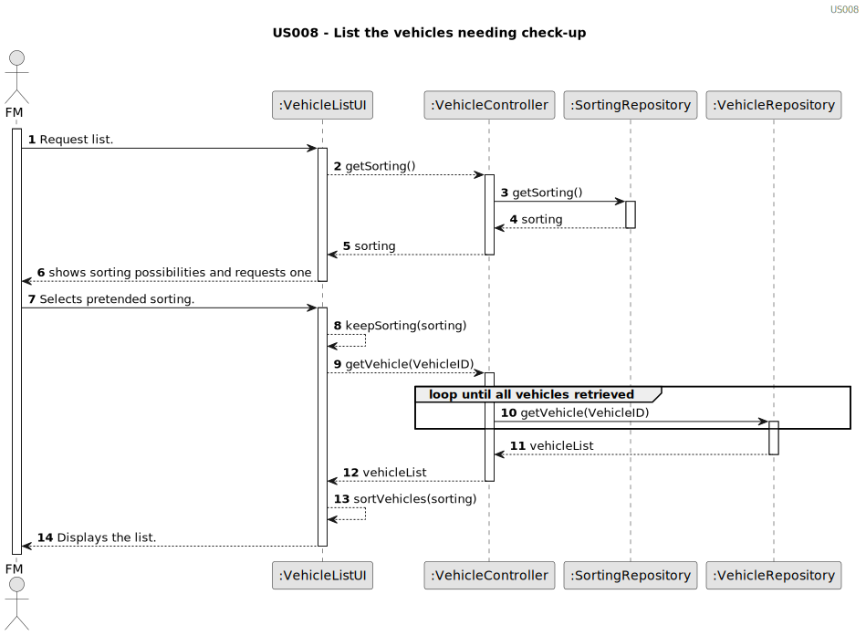

# US021 - Add Entry to the To-do List.
`
## 3. Design - User Story Realization 

### 3.1. Rationale

| Interaction ID | Question: Which class is responsible for...                                           | Answer                      | Justification (with patterns)                                                                                                                                                                                                                                                                                |
|:---------------|:--------------------------------------------------------------------------------------|:----------------------------|:-------------------------------------------------------------------------------------------------------------------------------------------------------------------------------------------------------------------------------------------------------------------------------------------------------------|
| Step 1    		   | ... interacting with the actor?                                                       | AddEntryToToDoListUI        | Pure Fabrication: A UI component is used to handle interactions with the user, as there is no specific class in the domain model responsible for these interactions.                                                                                                                                         |
|                | ... coordinating the US?                                                              |    GreenSpaceController                         | Controller: Manages the coordination of the process for green space-related operations, mediating between UI and other components.                                                                                                                                                                           |
|                | ... instantiating a new GreenSpace?                                                   |     GreenSpace                        | Creator: The GreenSpace class is responsible for creating its own instances.                                                                                                                                                                                                                                 |
|                | 	... knowing which green space types are available?                                   |   Creator: The GreenSpace class is responsible for creating its own instances.                          | Information Expert (IE): The GreenSpaceRepository is responsible for providing the available green space types.                                                                                                                                                                                              |
| Step 2         |                                                                                       |           |                                                                                                                                                                                                                                                                                                              |
| Step 3         | ... saving the inputted data?                                                         |  GreenSpaceRepository                           | IE: The GreenSpaceRepository is responsible for storing and managing the inputted data, ensuring its persistence within the system.                                                                                                                                                                          |
| Step 4         | ... selecting the green space type?                                                   | AddEntryToToDoListUI          | IE: The UI is responsible for allowing the user to select a green space type from the available ones.                                                                                                                                                                                                                                                                                                             |
|                | 	... knowing the green space details to display?                                      | GreenSpace     | IE: The GreenSpace class is responsible for accessing and providing detailed information about the available green spaces in the system.                                                                                                                                                                                                                                                                                                   |
| Step 5         | ... saving the selected green space type?                                             | GreenSpaceRepository               | IE: The GreenSpaceRepository is responsible for saving the selected green space type.                                                                                                                                                                                                                                                                                            |
| Step 6         |                                                                                       |                                    |                                                                                                                                                                                                                                                                                                                                                                                  |
| Step 7         |  ... validating all data?                                                                                     |   GreenSpaceRepository                                 |    	IE: The GreenSpaceRepository is responsible for validating the integrity and validity of the green space data, ensuring it complies with business rules.                                                                                                                                                                                                                                                                                                                                                                              |
|                |  	... saving the created green space?                                                                                                             |    GreenSpaceRepository                                |  IE: The GreenSpaceRepository is responsible for persisting the created GreenSpace instances in the system, ensuring their integrity and future availability.                                                                                                                                                                                                                                                                                                                                                                                |
| Step 8         |    ... informing operation success?                                                                                   |  AddEntryToToDoListUI                                  |     IE: AddEntryToToDoListUI handles user interactions and feedback, including notifying the user about the successful completion of the operation.                                                                                                                                                                                                                                                                                                                                                                             |

### Systematization ##

According to the taken rationale, the conceptual classes promoted to software classes are: 

Other software classes (i.e. Pure Fabrication) identified: 

## 3.2. Sequence Diagram (SD)

### Full Diagram

This diagram shows the full sequence of interactions between the classes involved in the realization of this user story.

## 3.3. Class Diagram (CD)

