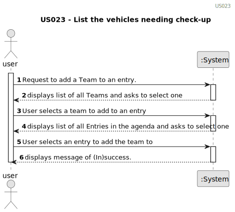

# US023 - Assign a Team to an entry in the Agenda

## 1. Requirements Engineering

### 1.1. User Story Description

As a GSM, I want to assign a Team to an entry in the Agenda.

### 1.3. Acceptance Criteria

* **AC1** A message must be sent to all team members informing them about the assignment
* **AC2** Different email services can send the message. These services must be defined through a configuration file to allow the use of different platforms (e.g. Gmail, DEI’s email service, etc.).

### 1.4. Found out Dependencies

* There is a dependency on "US22 - As a GSM, I want to add a new entry in the Agenda." as there must be at least one entry added to the Agenda to assign a team to it.

### 1.5 Input and Output Data
	
* Selected data:
    * order in which to show the vehicles. 

**Output Data:**

* List of existing vehicles needing check-up and their information.
* (In)Success of the operation

### 1.6. System Sequence Diagram (SSD)

