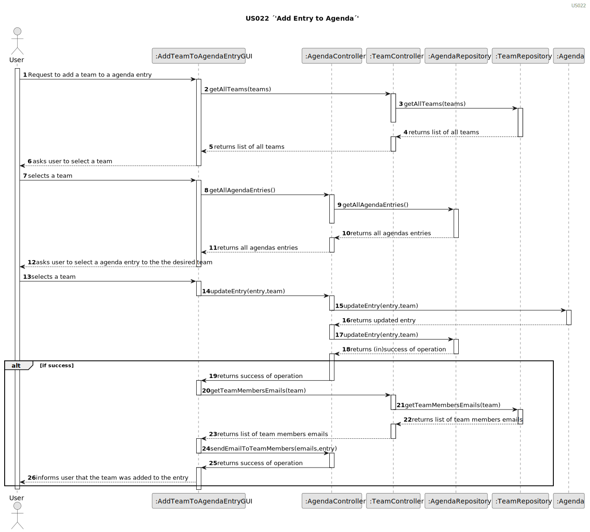
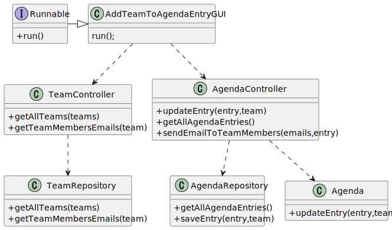

`# US023 - Assign a Team to an entry in the Agenda
`
## 3. Design - User Story Realization

### 3.1. Rationale

| Interaction ID                   | Question: Which class is responsible for...      | Answer                  | Justification (with patterns) |
|:---------------------------------|:-------------------------------------------------|:------------------------|:------------------------------|
| Step 1 : Request Teams List.  		 | ...instantiating the class that handles the UI?  | AddTeamToAgendaEntryGUI | Pure Fabrication              |
| Step 2 : Handles the operation of retrieving the teams list. | ..handling the operation of retrieving the teams list? | TeamController    | IE                            |
| Step 3 : Retriving the  teams list.                       | .. retrieving the teams list                           | TeamRepository    | Repository                    |
| Step 4 : Handles the operation of retrieving the Agenda Entries list. | ..handling the operation of retrieving the agenda entries list? | AgendaController    | IE                            |
| Step 5 : Retriving the  agenda entries list.                       | .. retrieving the agenda entries list                           | AgendaRepository    | Repository                    |
| Step 6 : updating the entry in the agenda with the team locally.   | ...locally updating the agenda entry?              | Agenda                | IE: owns its own data.        |
| Step 7 : saving the updated entry in the agenda globally.  | ...globally saving the updated agenda entry?             | AgendaRepository      | IE: owns all its data.        |

## 3.2. Sequence Diagram (SD)

## 3.3. Class Diagram (CD)

