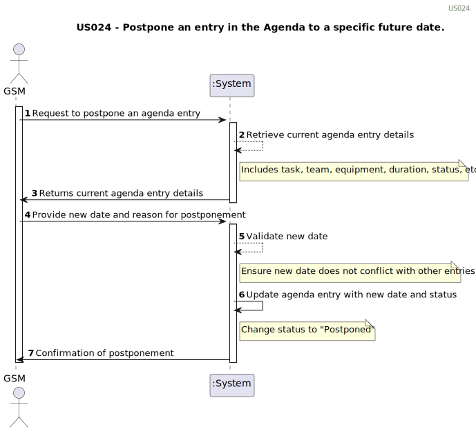

# US024 - Postpone an entry in the Agenda to a specific future date. 

## 1. Requirements Engineering

### 1.1. User Story Description

As a GSM, I want to Postpone an entry in the Agenda to a
specific future date.

### 1.2. Customer Specifications and Clarifications 

**From the client clarifications:**

> **Question:** The date you want to postpone in this US24 is the date referring to the "approximate expected duration" field when we registered the task?
>
> **Answer:** No; sometimes, for various reasons (e.g. insufficient staff, faulty equipment or adverse weather conditions) a task has to be postponed to a new date; task duration is not directly related to this.

>**Question:** What are the input to postpone an entry? From my perspective the Green Spaces Manager only needs to select the entry and introduce the new date.
> 
> **Answer:** Yes, you are correct!

### 1.3. Acceptance Criteria

* **AC1:** The GSM must be able to select an existing entry in the Agenda to postpone.
* **AC2:** The GSM must provide a specific new date to which the entry will be postponed.
* **AC3:** The system must validate the new date to ensure there are no conflicts with other entries.
* **AC4:** The status of the postponed entry should be updated to "Postponed".
* **AC5:** The system must provide confirmation to the GSM that the entry has been successfully postponed.

### 1.4. Found out Dependencies

* There is a dependency on "US20: Registration of green spaces", as Agenda entries are associated with these spaces.
* There is a dependency on "US21: Addition of new entries in the To-Do List", as Agenda entries derive from the To-Do List.
* There is a dependency on "US22: Addition of new entries in the Agenda", as the entry to be postponed must be previously registered in the Agenda.
* There is a dependency on "US23: Assignment of teams to Agenda entries", to notify the team about the task's date change.

### 1.5 Input and Output Data
	
* Existing Agenda Entry ID: The identifier of the entry to be postponed.
* New Date: The new specific date to which the entry will be postponed.
* Postponement Reason (optional): The reason for postponing the entry.

**Output Data:**

* Confirmation Message: A message confirming that the entry has been successfully postponed.
* Updated Agenda Entry: The details of the agenda entry, updated with the new date and status "Postponed."
* Error Message: If the new date conflicts with another entry or if there is any other validation error.

### 1.6. System Sequence Diagram (SSD)

