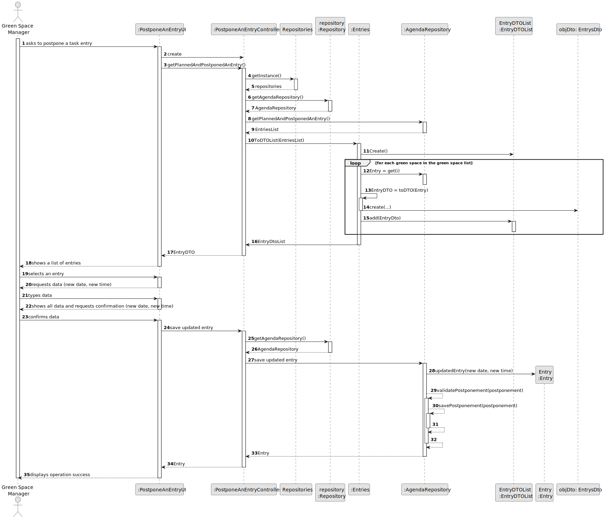
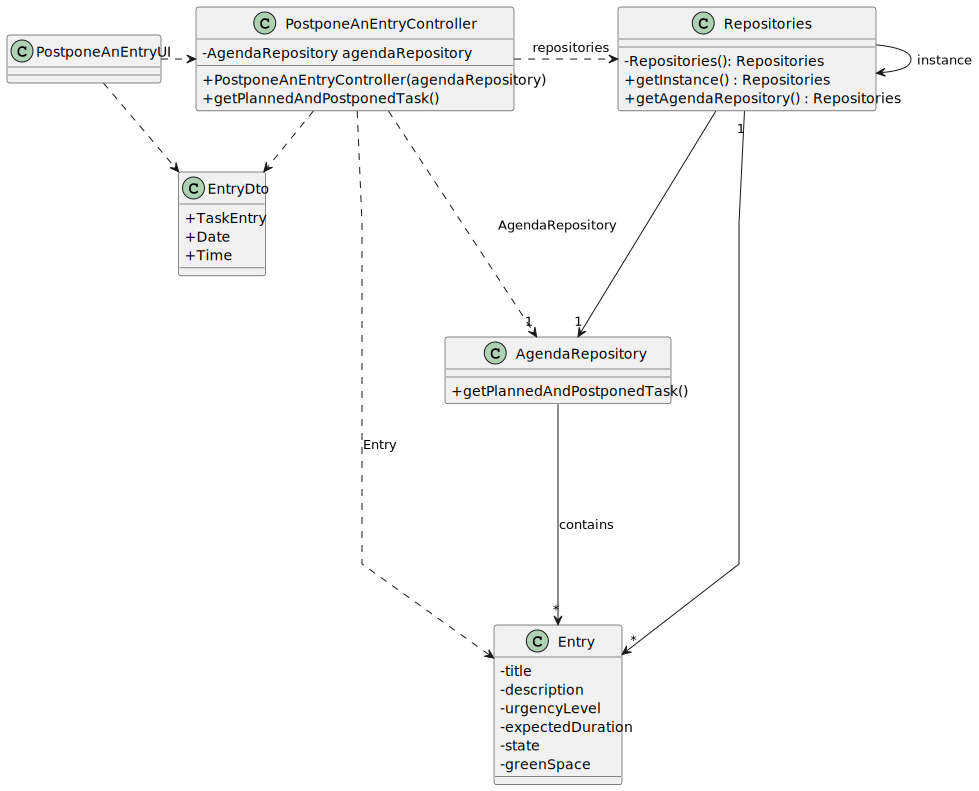

# US024 - Postpone Entry

## 3. Design - User Story Realization

### 3.1. Rationale

_**Note that SSD - Alternative One is adopted.**_

| Interaction ID | Question: Which class is responsible for...          | Answer                  | Justification (with patterns)                                                                                 |
|:---------------|:-----------------------------------------------------|:------------------------|:--------------------------------------------------------------------------------------------------------------|
| Step 1         | 	... interacting with the actor?                     | CancelAnEntryUI         | Pure Fabrication: there is no reason to assign this responsibility to any existing class in the Domain Model. |
| 	              | 	... coordinating the US?                            | CancelAnEntryController | Controller                                                                                                    |
| Step 2         | ...knowing the task entry list?                      | AgendaRepository        | IE: Knows all task entries' data and has methods to retrieve tasks that can be postponed.                     |
| 	              | ... displaying the form for the user to input data?  | CancelAnEntryUI         | IE: Is responsible for interacting with the actor.                                                            | 
| Step 3 	       | 	...temporarily saving the inputted data?            | CancelAnEntryUI         | IE: Is responsible for saving the imputed data temporarily.                                                   |
| Step 4         | 	...requesting confirmation?                         | CancelAnEntryUI         | IE: Is responsible for user interactions.                                                                     |
| Step 5		  	    | ...saving all data?                                  | Entry                   | IE: Has its own data.                                                                                         |
| 			  	         | 	... validating all data (local validation)?         | Entry                   | IE: owns all its data.                                                                                        |
| 			  	         | 	... validating all data (global validation)?        | AgendaRepository        | IE: knows all tasks entries.                                                                                  |
| Step 6  		     | 	... informing operation success?                    | CancelAnEntryUI         | IE: is responsible for user interactions.                                                                     |

### Systematization ##

According to the taken rationale, the conceptual classes promoted to software classes are:

* Agenda
* Entry

Other software classes (i.e. Pure Fabrication) identified:

* CancelAnEntryUI
* CancelAnEntryController
## 3.2. Sequence Diagram (SD)

_**Note that SSD - Alternative Two is adopted.**_

### Full Diagram

This diagram shows the full sequence of interactions between the classes involved in the realization of this user story.

## 3.3. Class Diagram (CD)

