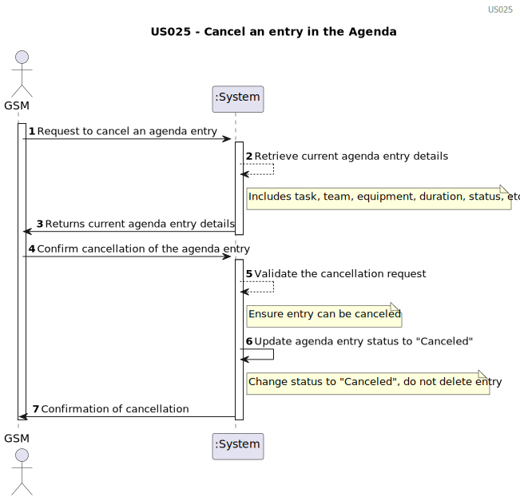

# US025 - Cancel an entry in the Agenda. 

## 1. Requirements Engineering

### 1.1. User Story Description

As a GSM, I want to Cancel an entry in the Agenda.

### 1.2. Customer Specifications and Clarifications 

**From the client clarifications:**

> **Question:** does the task associated with the Agenda entry in which this happens remain in the To-do List or can it be removed, unlike what happens in the Agenda? Or even, would this process be different between a completed task and a canceled task?
>
> **Answer:** Yes.
I suppose when a task goes to the Agenda, it leaves the To-Do list but maybe a different flow could be considered.

> **Question:** When a task is cancelled, is it possible to put it back on the agenda again later?
>
> **Answer:** yes.

>**Question:** 
> When we cancel a task, do we move it again to the To-Do List?
> 
> **Answer:** no.
### 1.3. Acceptance Criteria

* **AC1:** A canceled task should not be deleted but rather change its
  state.
* **AC2:** The GSM must be able to select an existing entry in the Agenda for cancellation.

### 1.4. Found out Dependencies

* There is a dependency on US22 because cancellation of an entry in the Agenda requires the entry to exist previously in the Agenda.
* There is a dependency on US23 Assignment of teams to Agenda entries may be affected by the cancellation of a task.

### 1.5 Input and Output Data
	
* Existing Agenda Entry ID:
  * The identifier of the entry to be canceled in the Agenda.

**Output Data:**

* Confirmation Message: A confirmation message informing that the entry has been successfully canceled.
* Error Message: If there is any issue during the cancellation process, such as failure in communication with the system or data validation, an appropriate error message should be provided.

### 1.6. System Sequence Diagram (SSD)

