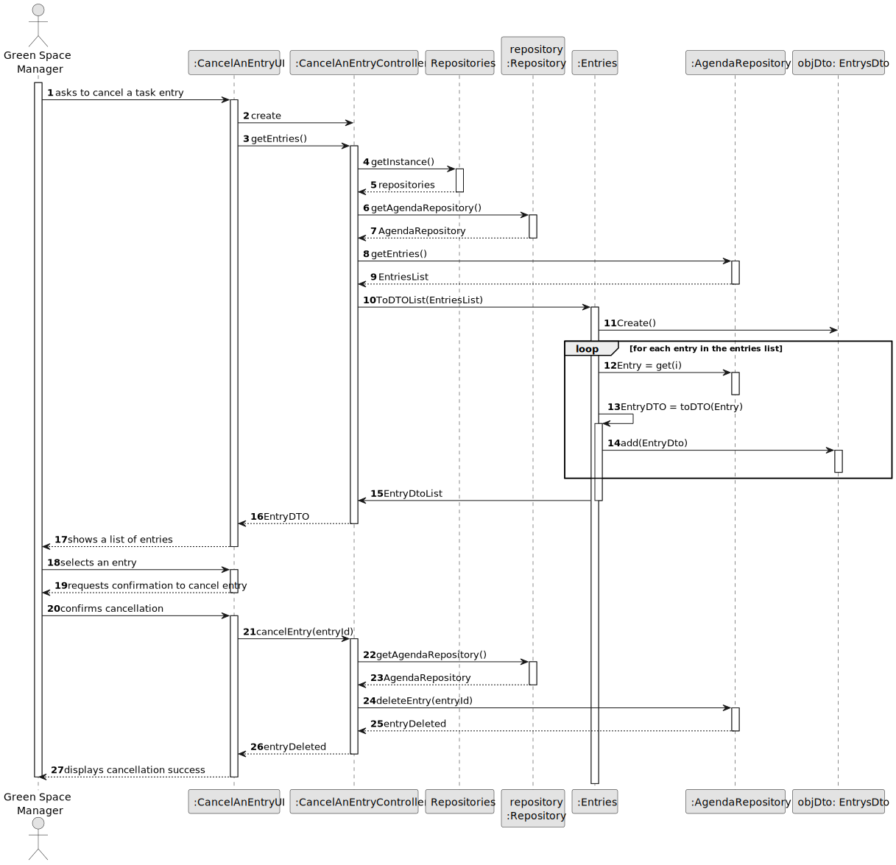
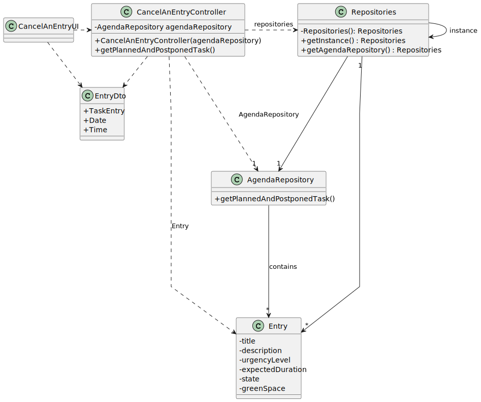

`# US008 - List the vehicles in need off check-up. 
`
## 3. Design - User Story Realization 

### 3.1. Rationale

| Interaction ID                                                          | Question: Which class is responsible for...          | Answer                | Justification (with patterns) |
|:------------------------------------------------------------------------|:-----------------------------------------------------|:----------------------|:------------------------------|
| Step 1 : Request list.  		                                              | ...instantiating the class that handles the UI?      | VehicleListUI         | Pure Fabrication              |
| Step 2 : Shows the possible ways to sort out data and  waits for input. | ..retrieving possible ways to sort data?             | VehicleController     | IE                            |
|                                                                         | 	...displaying the possible ways to show data?						 | VehicleListUI         | Pure Fabrication              |
| Step 3 : Selects pretended sorting.                                     |                                                      |                       |                               |
| Step 4 : Retrieval of vehicles information and sorting.                 | ...retrieval of vehicles information?                | VehicleController     | IE                            |
|                                                                         | ...sorting the vehicles?                             | VehicleListController | Controller                    |
| Step 5 : Return the list.                                               | ...showing the list?                                 | VehicleListUI         | Pure Fabrication              |

### Systematization ##

According to the taken rationale, the conceptual classes promoted to software classes are: 

Other software classes (i.e. Pure Fabrication) identified: 

## 3.2. Sequence Diagram (SD)

### Full Diagram

This diagram shows the full sequence of interactions between the classes involved in the realization of this user story.

## 3.3. Class Diagram (CD)

