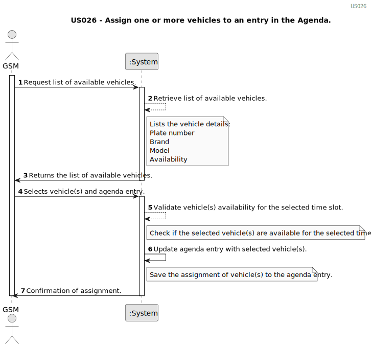

# US026 - Assign one or more vehicles to an entry in the Agenda.

## 1. Requirements Engineering

### 1.1. User Story Description

As a GSM, I want to assign one or more vehicles to an entry in the Agenda.

### 1.2. Customer Specifications and Clarifications 

**From the client clarifications:**

> **Question:** What are the requests/ input data to list the vehicles needing the check-up?
> Type of vehicle, Current Km and Maintenance/Check-up Frequency (in Kms) are sufficient?
>
> **Answer:** Current Km and Maintenance/Check-up Frequency (in Kms) are sufficient, yes;

> **Question:** Are there acceptance criteria when asking for the list?
>
> **Answer:** The list must clearly identify the vehicles through: plate number, brand, model and the that justified the checkup need.

### 1.3. Acceptance Criteria

* **AC1:** When a user requests the list of vehicles needing check-up, the system should display the following information for each vehicle:

    * Plate number
    * Brand 
    * Model
    * Reason for check-up need
  
* **AC2:** The system should calculate the vehicles needing check-up based on the following criteria:

  * If the current kilometers of a vehicle exceed its maintenance/check-up frequency.

* **AC3:** The FM must be able to sort out the list.
* **AC4** The list should be easy to understand and navigate, facilitating quick identification of vehicles needing attention.

### 1.4. Found out Dependencies

* There is a dependency on "US007 - Register vehicle for check-up" as there must be at least one vehicle to create a list.

### 1.5 Input and Output Data
	
* Selected data:
    * order in which to show the vehicles. 

**Output Data:**

* List of existing vehicles needing check-up and their information.
* (In)Success of the operation

### 1.6. System Sequence Diagram (SSD)

