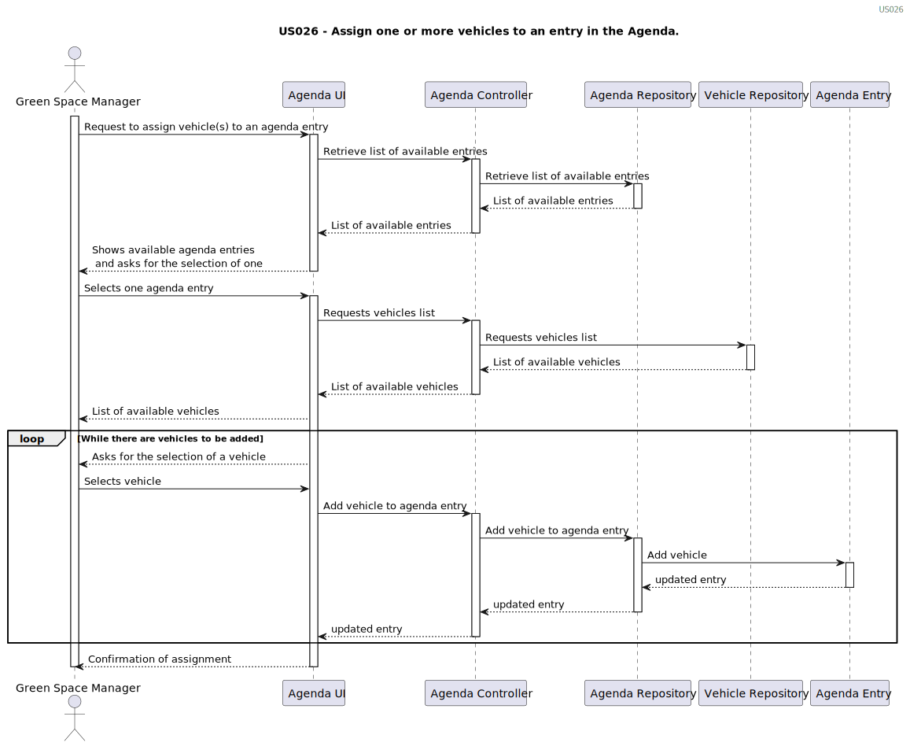
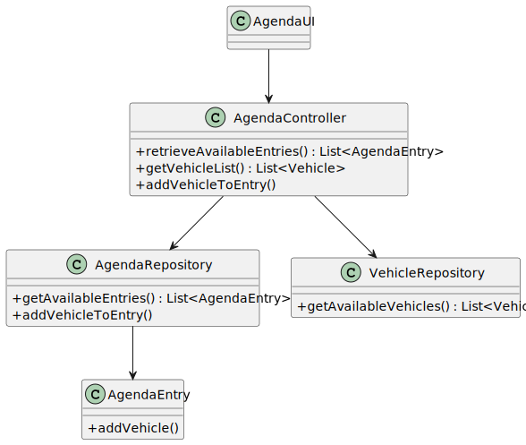

`# US026 - Assign one or more vehicles to an entry in the Agenda.
`
## 3. Design - User Story Realization 

### 3.1. Rationale

| Interaction ID                                            | Question: Which class is responsible for...                                                  | Answer                       | Justification (with patterns) |
|:----------------------------------------------------------|:---------------------------------------------------------------------------------------------|:-----------------------------|:------------------------------|
| Step 1 : Request to assign vehicle(s) to an agenda entry	 | ...handling the initial request from the user?                                               | AgendaUI                     | Pure Fabrication              |
| Step 2 : Retrieve list of available entries               | ...retrieving the list of available agenda entries?                                          | AgendaController             | IE                            |
|                                                           | 	...retrieving the data from the repository?					                                            | AgendaRepo                   | IE                            |
|                                                           | ...displaying the list of available agenda entries to the user?                              | AgendaUI                     | Pure Fabrication              |
| Step 3 : Selects one agenda entry                         | ...selecting an agenda entry?                                                                | Green Space Manager          | Controller                    |
| Step 4 : Requests vehicles list                           | ...requesting the list of available vehicles?                                                | AgendaController             | IE                            |
|                                                           | ...retrieving the vehicle data from the repository?                                          | VehicleRepo                  | IE                            |
|                                                           | ...displaying the list of available vehicles to the user?                                    | AgendaUI                     | Pure Fabrication              |
| Step 5 : While there are vehicles to be added             | ...iteratively selecting vehicles to add to the agenda entry?                                | Green Space Manager          | Controller                    |
|                                                           | ...handling the addition of a vehicle to the agenda entry?                                   | AgendaController             | IE                            |
|                                                           | ...updating the agenda entry with the selected vehicle?                                      | AgendaRepo                   | IE                            |
|                                                           | ...storing the updated agenda entry?                                                         | AgendaEntry                  | Entity                        |
| Step 6: Confirmation of assignment                        | ...confirming the assignment of vehicles to the agenda entry?                                | AgendaUI                     | Pure Fabrication              |

### Systematization ##

According to the taken rationale, the conceptual classes promoted to software classes are: 

Other software classes (i.e. Pure Fabrication) identified: 

## 3.2. Sequence Diagram (SD)

### Full Diagram

This diagram shows the full sequence of interactions between the classes involved in the realization of this user story.

## 3.3. Class Diagram (CD)

