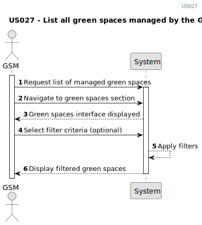

# US027 - List all green spaces managed by the GSM

## 1. Requirements Engineering

### 1.1. User Story Description

As a GSM, I need to list all green spaces managed by the GSM.

### 1.2. Customer Specifications and Clarifications 

**From the specifications document:**

> "Green Spaces Manager (GSM) - the person responsible for managing the green spaces in charge of the organization."

> "The green spaces management aims (within the available budget) to design,
build and maintain parks and gardens that meet the requirements of the
common citizen who wants to be informed."

> 
**From the client clarifications:**

> **Question:** Dear client, which info about Green Spaces do you want the GSM see when listing? only the name ?
>
> **Answer:** Each de team can decide about the aspects related to UX/UI.

> **Question:** 
>
>  **Answer:** 
### 1.3. Acceptance Criteria

* **AC1:** Display Green Spaces List
* The system must provide a user interface that lists all green spaces managed by the GSM
* Each entry in the list must display key details of the green space, including:
  * Name of the green space
  * Location (address or coordinates)
  * Size or area of the green space
  * Description(optional)

  
* **AC2:** Search and Filter Functionality:

  * The system must allow the GSM to search for green spaces by name or location.
  * The system must provide filter options based on green space type and size range.

### 1.4. Found out Dependencies

* There is a dependency on " US020- As a Green Space Manager (GSM), I want to register a green
  space (garden, medium-sized park or large-sized park) and its respective
  area."

### 1.5 Input and Output Data
	
**Input data:**

* Opcional filters
* Sorting Preferences

**Output Data:**

* List of Green Spaces

### 1.6. System Sequence Diagram (SSD)

