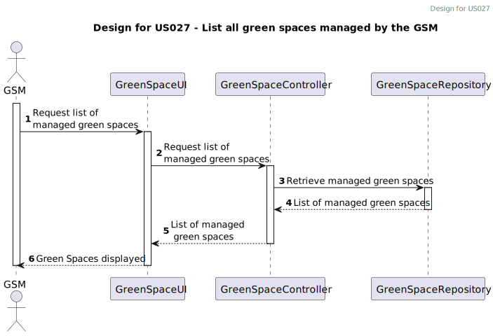
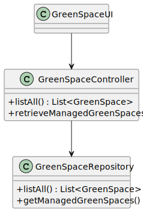

`# US008 - List the vehicles in need off check-up. 
`
## 3. Design - User Story Realization 

### 3.1. Rationale

| Interaction ID | Question: Which class is responsible for... | Answer               | Justification (with patterns) |
|:---------------|:--------------------------------------------|:---------------------|:------------------------------|
| Step 1 :  		   | ...request list of managed green spaces?    | GreenSpaceUI         | Pure Fabrication              |
| Step 2 :       | ..retrieves managed green spaces?           | GreenSpaceController | IE                            |
| Step 3 :       | ...retrieving managed green spaces?         | GreenSpaceRepository | IE                            |
| Step 4 :       | ...returns list of managed green spaces?    | GreenSpaceController | Controller                    |
| Step 5 :       | ...displays list of managed green spaces?   | GreenSpaceUI         | Pure Fabrication              |

### Systematization ##

According to the taken rationale, the conceptual classes promoted to software classes are: 

Other software classes (i.e. Pure Fabrication) identified: 

## 3.2. Sequence Diagram (SD)

### Full Diagram

This diagram shows the full sequence of interactions between the classes involved in the realization of this user story.

## 3.3. Class Diagram (CD)

