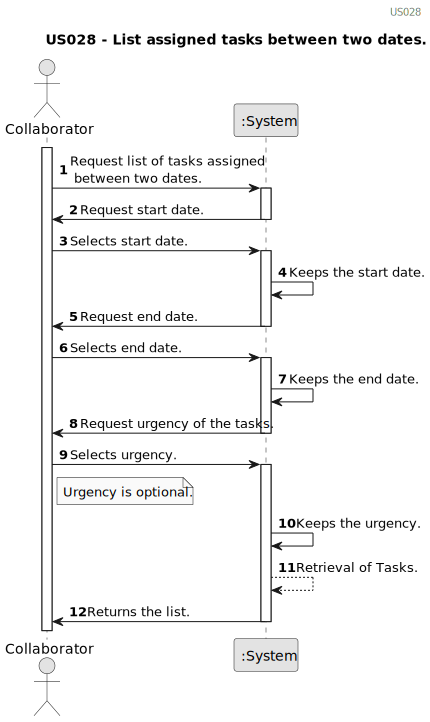

# US028 - List assigned tasks between two dates. 

## 1. Requirements Engineering

### 1.1. User Story Description

As a Collaborator, I wish to consult the tasks assigned to me between two dates.

### 1.2. Customer Specifications and Clarifications 

**From the client clarifications:**

> **Question:** Could a task belong to different teams and collaborators? I mean,
> if the status, degree of urgency and expect duration belong to an entry of the to do list
> and the task is something generic that can be reused, or if the task could belong
> only to one collaborator, and for another you have to create another one
>
> **Answer:** No.
Maybe a distinction should be made between type of task and a task.
Task type is "Pruning trees", a specific task is "Pruning trees" in specific park in a specific date.

> **Question:**
"As a Collaborator, I wish to consult the tasks assigned to me". That means that the collaborator
> can have more than one task assigned to them. To ensure that, the same task should be available
> for more than one team, am I right? The reason for that question is so that if a task 
> is strictly related to only one team, a collaborator will end up being in
> two teams simultaneously, which cannot happen.
>
> **Answer:** A team can have multiple task assigned, hence, if a collaborator belongs to a team.
Besides, a collaborator can move from a team to another, so during,
> for instance, a month period a collaborator can belong to multiples teams.

### 1.3. Acceptance Criteria

* **AC1**: The list of green spaces must be sorted by date.
* **AC2**: The Collaborator should be able to filter the results by the
status of the task.

### 1.4. Found out Dependencies

* There is a dependency on US22 because there's need to have an entry in the Agenda.
* There is a dependency on US23 a Collaborator needs to be assigned to a team and therefore to a task in the Agenda.

### 1.5 Input and Output Data

* **Input Data:**
  * Two dates (start and end) to filter the tasks.

* **Selected data:**
    * The status in which to view the Tasks. 

**Output Data:**

* List of assigned tasks ordered by date.
* (In)Success of the operation

### 1.6. System Sequence Diagram (SSD)

