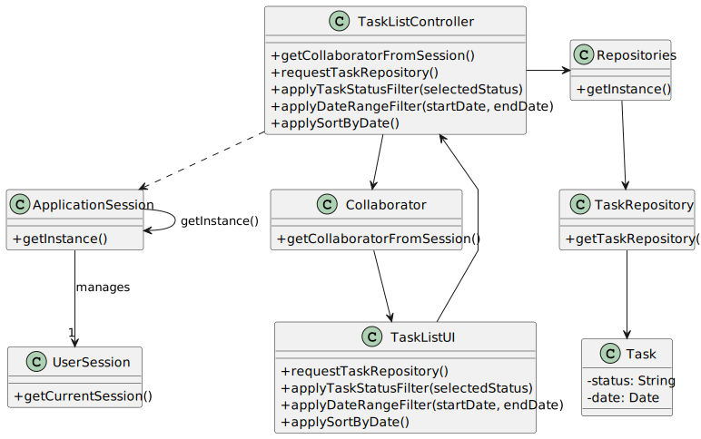

# US28 - Consult Assigned Tasks

## 3. Design - User Story Realization

### 3.1. Rationale

_**Note that SSD - Alternative Two is adopted.**_

| Interaction ID | Question: Which class is responsible for... | Answer              | Justification (with patterns)                                                                                 |
|:---------------|:--------------------------------------------|:--------------------|:--------------------------------------------------------------------------------------------------------------|
| Step 1         | ... interacting with the actor?             | :TaskListUI         | Pure Fabrication: there is no reason to assign this responsibility to any existing class in the Domain Model. |
|                | ... coordinating the US?                    | :TaskListController | Controller                                                                                                    |
| Step 2         | ... storing the Task?                       | :TaskRepository     | Pure Fabrication, IE: owns all data                                                                           |

### Systematization ##

According to the taken rationale, the conceptual classes promoted to software classes are:

* Task

Other software classes (i.e. Pure Fabrication) identified:

* :TaskListUI
* :TaskListController

## 3.2. Sequence Diagram (SD)

_**Note that SSD - Alternative Two is adopted.**_

### Full Diagram

This diagram shows the full sequence of interactions between the classes involved in the realization of this user story.

## 3.3. Class Diagram (CD)

