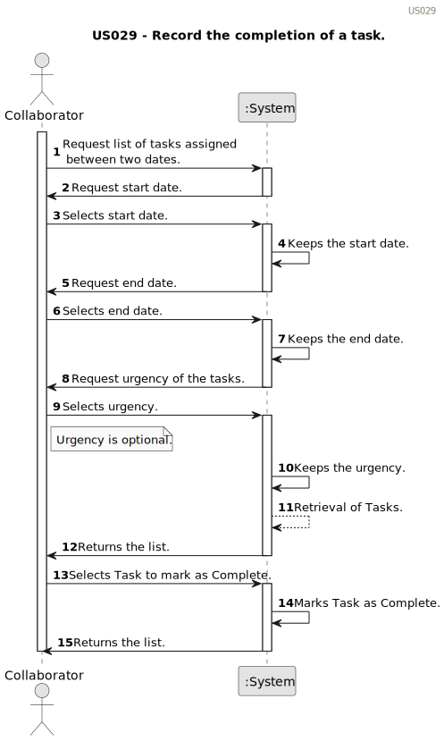

# US029 - Record the completion of a task. 

## 1. Requirements Engineering

### 1.1. User Story Description

US29 - As a Collaborator, I want to record the completion of a task.

### 1.2. Customer Specifications and Clarifications 

**From the client clarifications:**

> This "record" refers to the act of only changing the status of the task, or do we want to save a list of the completed tasks within each Collaborator?
> 
> **Answer:** It means to record that a task was completed (changing the status) with the finish time

### 1.3. Acceptance Criteria

* **AC1:** The system should record the date and time when the task was marked as completed.
* **AC2:** The Collaborator must be able to sort out the list.
* **AC3:** The system must show the list of tasks that have been completed.

### 1.4. Found out Dependencies

* There is a dependency on US22 because there's need to have an entry in the Agenda.
* There is a dependency on US23 a Collaborator needs to be assigned to a team and therefore to a task in the Agenda.

### 1.5 Input and Output Data
	
* Selected data:
    * the Task to record as complete.

**Output Data:**

* (In)Success of the operation

### 1.6. System Sequence Diagram (SSD)

