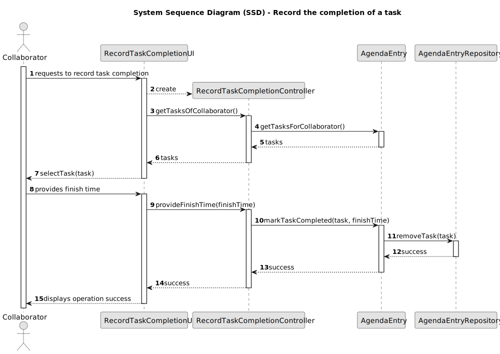
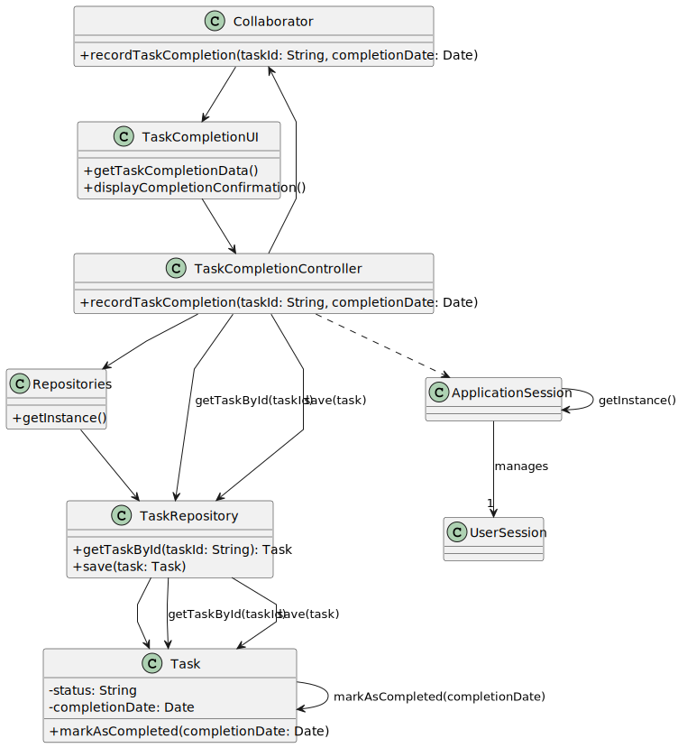

`# US008 - List the vehicles in need off check-up. 
`
## 3. Design - User Story Realization 

### 3.1. Rationale

| Interaction ID                                                          | Question: Which class is responsible for...                                            | Answer                | Justification (with patterns) |
|:------------------------------------------------------------------------|:---------------------------------------------------------------------------------------|:----------------------|:------------------------------|
| Step 1 : Step 1: Request task completion.  		                           | ...instantiating the class that handles the UI?                                        | CompleteTaskUI                      | Pure Fabrication              |
| Step 2 : Shows the possible ways to sort out data and  waits for input. | ...displaying the form for task completion?                                            | CompleteTaskUI    | Pure Fabrication              |
|                                                                         | 	...retrieving task details and completion status?						                               | CompleteTaskController         | IE                            |
| Step 3: Submits completion details.                                     |                                                                                        |                       |                               |
| Step 4: Save completion details.                                        | ....saving the task completion details?                                                | Task  | IE                            |
|                                                                         | ...sorting the vehicles?                                                               | Task | IE                            |
|                                                                         | ...updating task status in repository?                                                 |           TaskRepository            | 	IE                              |
| Step 5: Return success confirmation.                                    | ...displaying success message?                                                                                       | CompleteTaskUI         | Pure Fabrication              |

### Systematization ##

According to the taken rationale, the conceptual classes promoted to software classes are:

* Task 

Other software classes (i.e. Pure Fabrication) identified:

* CompleteTaskUI
* CompleteTaskController

## 3.2. Sequence Diagram (SD)

### Full Diagram

This diagram shows the full sequence of interactions between the classes involved in the realization of this user story.

## 3.3. Class Diagram (CD)

